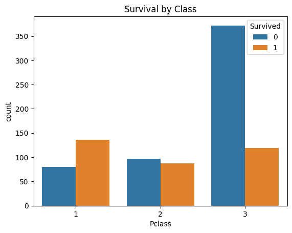
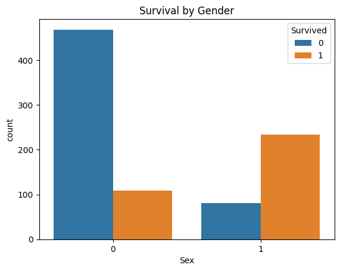
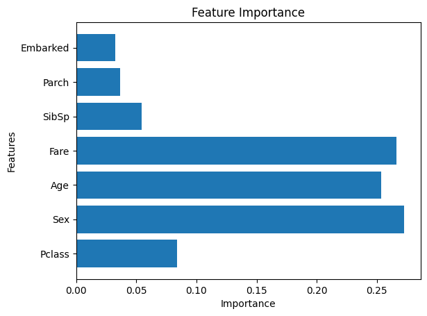

# 🚢 Titanic Survival Prediction

## 📌 About the Project
I worked on this project to understand how machine learning can be used to make predictions using real-world data. The goal was to predict whether a passenger survived the Titanic disaster based on different features like age, gender, class, etc.

---

## 📊 Dataset
The dataset contains information about passengers such as:
- Age
- Gender
- Passenger class
- Fare
- Family members onboard
- Port of embarkation

---

## 🧹 Data Cleaning
While exploring the dataset, I noticed some missing values:
- Filled missing values in **Age** using median
- Filled **Embarked** with the most common value
- Dropped **Cabin** column because it had too many missing values

---

## 🔄 Data Preprocessing
To train the model, I converted categorical data into numbers:
- Male → 0, Female → 1  
- Embarked (S, C, Q) → 0, 1, 2  

---

## 🤖 Models Used
I tried two models:
- Logistic Regression  
- Random Forest  

---
## 📊 Visualizations

### Survival by Class

### Survival by Gender

### Feature Importance

---

## 📈 Results
- Logistic Regression accuracy: **~79.8%**
- Random Forest accuracy: **~81.5%**

Random Forest performed slightly better, so I considered it the better model for this dataset.

---

## 🧠 What I Learned
Some interesting things I noticed from the data:
- Women had a much higher survival rate than men  
- Passengers in higher classes were more likely to survive  
- Factors like fare and age also had an impact  

---

## 🛠️ Tools Used
- Python  
- Pandas  
- NumPy  
- Scikit-learn  
- Matplotlib & Seaborn  

---

## 🚀 Final Thoughts
This project helped me understand the complete workflow of a machine learning project — from cleaning data to building and evaluating models.  

I’m still learning, and I’d love to improve this further by trying more models and tuning them.

---

## 👤 Author
Siddhi
If you found this useful, feel free to ⭐ the repo!
